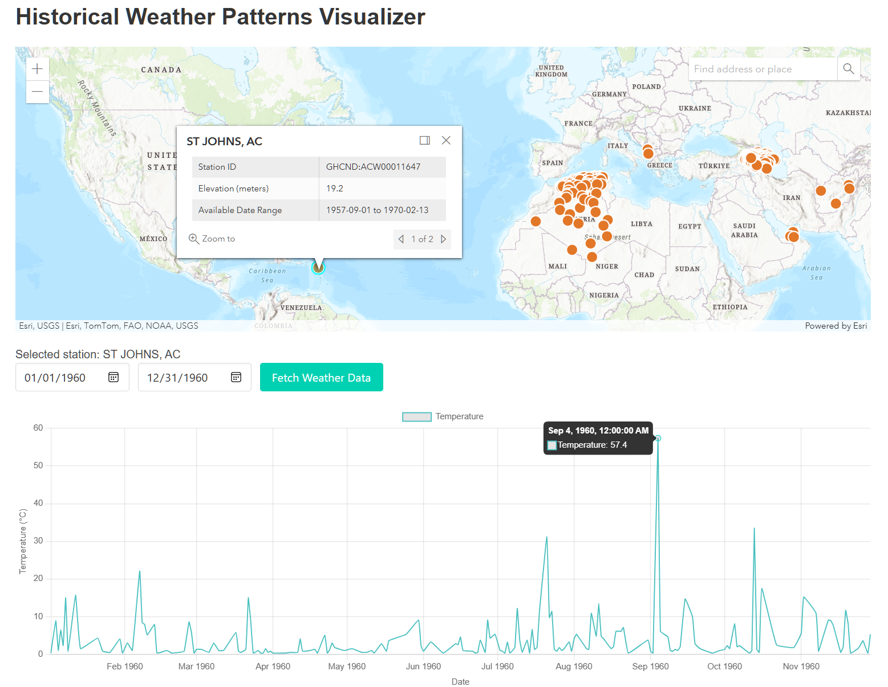
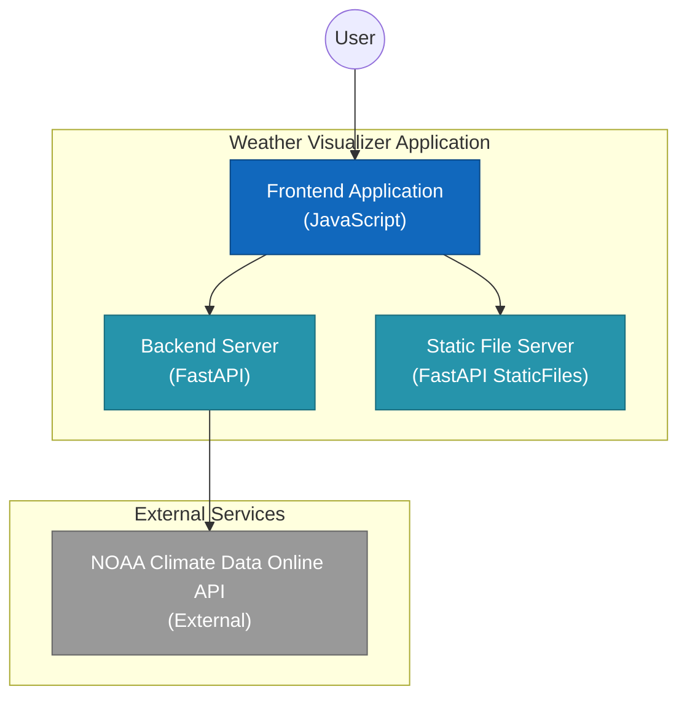

# Historical Weather Patterns Visualizer

This project is a web application that visualizes historical weather patterns using data from the NOAA Climate Data Online (CDO) API. It allows users to select weather stations on a map, choose a date range, and view temperature trends over time.



## Features

- Interactive map interface for selecting weather stations
- Detailed station information display with available date ranges
- Custom date range selection for data retrieval
- Temperature trend visualization using line charts
- Zoom functionality for detailed data exploration
- Automatic date range adjustment based on data availability
- Clear error messaging and data availability alerts
- Backend API for efficient data retrieval from NOAA Climate Data Online (CDO)
- Responsive design for various device sizes

## Prerequisites

Before you begin, ensure you have met the following requirements:

- Python 3.7+
- pip (Python package manager)
- A NOAA Climate Data Online (CDO) API key

## Installation

1. Clone the repository:
   ```
   git clone https://github.com/esoltys/weather-patterns-visualizer.git
   cd weather-patterns-visualizer
   ```

2. Create a virtual environment and activate it:
   ```
   python -m venv venv
   source venv/bin/activate  # On Windows, use `venv\Scripts\activate`
   ```

3. Install the required packages:
   ```
   pip install -r requirements.txt
   ```

4. Set up your NOAA API key:
   - Request a key from https://www.ncdc.noaa.gov/cdo-web/token
   - Add your NOAA CDO API key to the `.env` file:
     ```
     NOAA_API_TOKEN=your_actual_api_token_here
     ```

## Usage

1. Start the FastAPI server:
   ```
   cd backend
   uvicorn main:app --reload
   ```

2. Open a web browser and navigate to `http://localhost:8000`

3. Use the application:
   - Select a weather station on the map
   - Choose a start and end date
   - Click "Fetch Weather Data" to view the temperature trend

## Architecture



## License

This project is licensed under the MIT License - see the LICENSE file for details.

## Acknowledgments

- NOAA for providing the Climate Data Online API
- ArcGIS for their JavaScript API
- Chart.js for data visualization